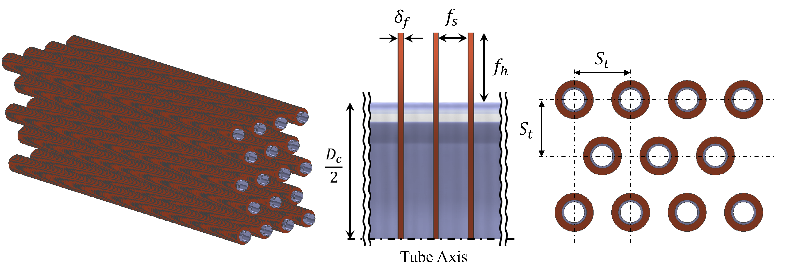

# 열교환기 설계 최적화 연구 (Heat Exchanger Design Study)

<table>
  <tr>
    <td align="center">
      <br>
      (a) 열교환기 형상 설정
    </td>
    <td align="center">
      <br>
      (b) 워크플로우 및 프레임워크
    </td>
  </tr>
</table>

이 저장소는 핀-튜브 열교환기(Fin-Tube Heat Exchanger)의 설계를 최적화하기 위한 **All-in-One 대시보드** 및 개별 스크립트를 제공합니다.

---

## 🚀 대시보드 실행 (간편 모드)

복잡한 명령어 없이 **배치 파일(`run_dashboard.bat`)**을 더블 클릭하면 자동으로 환경을 설정하고 대시보드를 실행합니다.

1. `HeatExchanger` 폴더로 이동합니다.
2. **`run_dashboard.bat`** 파일을 실행합니다.
   - 첫 실행 시: 자동으로 가상환경(`.venv`)을 만들고 필요한 패키지를 설치합니다. (시간이 조금 걸릴 수 있습니다.)
   - 이후 실행 시: 즉시 대시보드가 열립니다.

---

## 🧪 예시 시나리오 (Example Scenarios)

대시보드의 **Introduction** 탭에서 미리 정의된 시나리오를 불러올 수 있습니다. 각 시나리오 버튼을 클릭하면 해당 설정값이 자동으로 입력됩니다.

### 1. Scenario A: Standard (표준)
- **설명**: 일반적인 작동 조건에서의 설계입니다.
- **설정**:
  - 온도: 14.8 °C
  - 유속: 2.0 m/s
  - 안전율(k_sigma): 1.0

### 2. Scenario B: High Precision (고정밀)
- **설명**: 더 많은 샘플링과 높은 안전율을 적용하여 신뢰성 높은 설계를 탐색합니다.
- **설정**:
  - 샘플 수: 5,000개
  - 온도: 25.0 °C
  - 안전율(k_sigma): 2.0

### 3. Scenario C: High Velocity (고유속)
- **설명**: 높은 유속 환경에서의 성능을 최적화합니다.
- **설정**:
  - 유속: 5.0 m/s
  - 온도: 20.0 °C

---

## 📂 폴더 구조 및 주요 기능

```text
HeatExchanger/
├── run_dashboard.bat      # [NEW] 원클릭 실행 파일 (Windows용)
├── dashboard.py           # All-in-One 실행 대시보드
├── requirements.txt       # 의존성 패키지 목록
├── data/                  # 데이터 저장소 (CSV, XLSX)
├── model/                 # 학습된 모델 저장소 (.joblib)
├── figure/                # 시각화 결과 저장소
└── scripts/               # 핵심 로직 스크립트
```

### 1. 설계 샘플 생성 (Sampling)
- LHS(Latin Hypercube Sampling)를 이용해 기하학적 제약조건을 만족하는 설계 변수를 생성합니다.

### 2. 다공성 파라미터 매핑 (Mapping / Pyhsics)
- 핀-튜브 형상을 다공성 매질로 가정하여 Darcy-Forchheimer 파라미터(점성/관성 저항)를 계산합니다.
- **알고리즘**: Nir (1991) 상관식을 이용하여 압력강하($\Delta P$)를 계산하고, 속도-압력강하 곡선을 피팅하여 계수를 도출합니다.

### 3. **대리 모델 학습 (Surrogate Modeling)**
- CFD 결과를 기반으로 열유속(Q'') 및 압력강하(ΔP) 예측 모델 학습 (Gaussian Process)

> **Note**: 초기 학습에 필요한 CFD 데이터(`total_2D_Data.xlsx`)는 제공된 Google Drive 링크에서 다운로드하여 `data/` 폴더에 위치시켜야 합니다.

### 4. 최적화 (Optimization)
- 유전 알고리즘(Genetic Algorithm)을 사용하여 열전달 효율은 높이고 압력강하는 낮추는 최적의 설계를 찾습니다.
- **Conservative Fitness**: 예측의 불확실성(표준편차 $\sigma$)을 고려하여 보수적이고 안전한 설계를 제안합니다.

---

## 💻 수동 실행 방법 (고급 사용자)

배치 파일을 사용하지 않고 직접 명령어로 실행하려면 다음을 따르세요.

```bash
# 가상환경 생성
py -m venv .venv
.venv\Scripts\activate

# 패키지 설치
pip install -r requirements.txt

# 대시보드 실행
streamlit run dashboard.py
```
